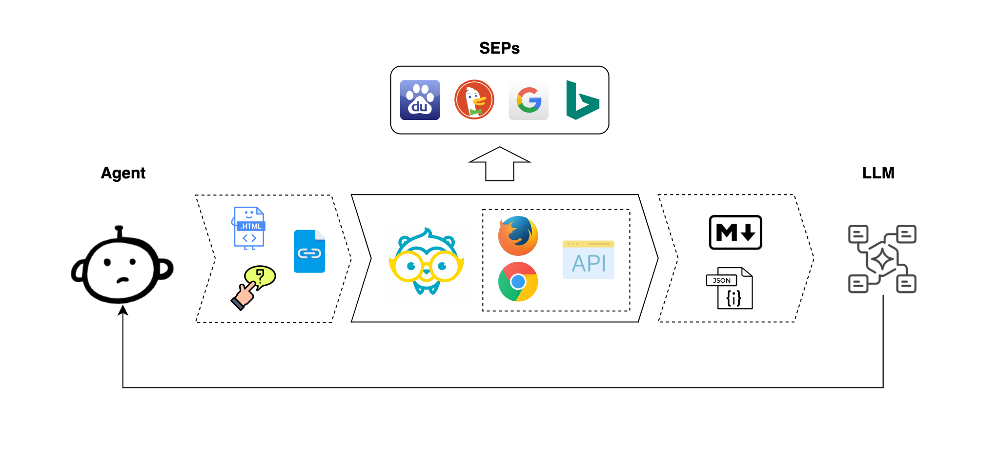

<div align="center">
  
</div>
<h1 align="center">tarzi</h1>  
<p align="center">
  <a href="https://crates.io/crates/tarzi">
    
  </a>
  <a href="https://pypi.org/project/tarzi/">
    
  </a>
  <!-- CI and Docs -->
  <a href="https://github.com/mirasurf/tarzi/actions/workflows/rust-ci.yml">
    
  </a>
  <a href="https://github.com/mirasurf/tarzi/actions/workflows/python-ci.yml">
    
  </a>
  <a href="https://tarzirs.readthedocs.io/en/latest/">
    
  </a>
  <!-- License -->
  <a href="https://www.apache.org/licenses/LICENSE-2.0">
    
  </a>
  <!-- X (formerly Twitter) -->
  <a href="https://x.com/mirasurf_ai">
    
  </a>
</p>

## 🐒 Tarzi

**Tarzi** is a unified search interface designed for **Retrieval-Augmented Generation (RAG)** and **agentic systems** built on large language models. Search is a core functionality in these systems, yet most search engine providers (SEPs) impose API paywalls or strict rate limits. **Tarzi**, empowered by browser automation and web crawling technologies, removes these barriers by supporting token-free queries across multiple search engines. With a single dependency, you can integrate and switch between different SEPs as needed—seamlessly and efficiently.

<div align="center">
  
</div>

## ⚙️ Core Capabilities

- 🦀 **Dual Implementation**: Native Rust library and Python wrapper with CLI tools
- 🔄 **Content Conversion**: Convert raw HTML into Markdown, JSON, or YAML, which is ready for LLMs
- 🔍 **Search Integration**: Fetch fully rendered result pages with a unified interface for token-free headless browser mode
- 🧠 **Multi-Engine Support**: Works with Bing, Google, DuckDuckGo, Baidu etc.
- 🛡️ **Proxy Support**: Bypass network bans using proxy support to access global SEPs
- 🚀 **End-to-End Workflow**: Full pipeline from search to content extraction for AI and automation use cases

## 🧪 Advanced Features (Under dev.)

- 🖥️ **Custom Browser Controls**: Set screen size, viewport, and locale for realistic behavior  
- 🕵️‍♂️ **Anti-Bot Evasion**: Use fingerprint spoofing, proxy rotation, and human-like actions to avoid detection  
- 🧠 **Smarter Queries**: Improve search results with prompt rewriting and intent-aware queries 
- 🔗 **Workflow Automation**: Chain steps like search, click, form fill, and scraping into automated flows  
- 🤖 **Agent Integration (MCP)**: Connect with agent frameworks for context-aware, distributed task execution  
- 📊 **Observability**: Monitor success rate, latency, CAPTCHA frequency, and export logs for analysis

## Install

```
pip install tarzi
```

## CLI Commands

Tarzi provides two command-line interfaces:

- **`tarzi`**: Native Rust CLI (faster, more efficient)
- **`pytarzi`**: Python CLI (easier to extend, same functionality)

Both CLIs support the same commands and configuration precedence.

## Usage Examples

* Examples in Python and Rust: [examples](/examples/)

## Alternatives

* LangChain [PlayWrightBrowserToolkit](https://python.langchain.com/docs/integrations/tools/playwright/)

## Contributors

Thank you ❤ all human and non-human contributors.

[](https://github.com/mirasurf/tarzi/graphs/contributors)
